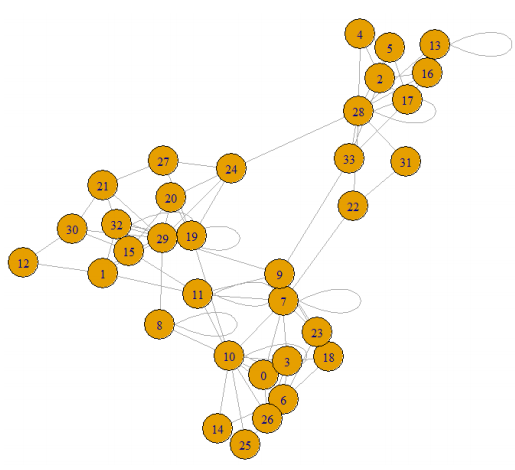

# A5--Socila-networking--Local-community-detection-using-Ensemble-clustering

### The Local Community from one specific node depends largely on the modularity function applied. To determine the best local modularity to apply, we create a model using a vector of centralities and trained using the ground-truth of benchmark networks. We applied the tests on artificial networks generated by LRF generator to predict the best modularity that can be applied to each node of the network. Using the best modularity that the ML models predicted, we constructed consensus matrix and used ensemble clustering by CSPA on the constructed consensus matrix. To check the efficiency of the ensemble clustering, we also Performed ensemble clustering on the LRF’s known ground truth and compared the clustering efficiency. The results of which are communicated in terms of accuracy and NMI.

